# Circuit Schematic Viewer - Technical Specification

## Overview

The Circuit Schematic Viewer is a web application that parses circuit.md files and renders interactive, filterable schematic diagrams. Rather than attempting to generate a single comprehensive schematic (which would require sophisticated auto-layout comparable to human effort), the viewer provides query and filter interfaces that allow users to explore circuits incrementally—viewing subsets of components and connections based on nets, components, or graph depth.

### Design Philosophy

Traditional schematic tools demand complete, well-laid-out diagrams. This viewer takes a different approach: treat the circuit topology as a queryable graph database. Users can slice the circuit by net, component, or neighborhood, viewing manageable subgraphs with automatically generated layouts. The auto-layout need not be perfect because each view shows a focused subset rather than the entire design.

This approach transforms circuit.md from a documentation format into an interactive exploration tool, enabling rapid comprehension of unfamiliar circuits and design review workflows.

### Target Users

- Hardware engineers reviewing circuit designs documented in circuit.md format
- Developers working on firmware who need to understand hardware topology
- Design reviewers performing collaborative circuit reviews
- Anyone exploring the ESP32 IR Remote project's hardware design

## Functional Requirements

### Circuit Loading

The viewer MUST load circuit.md files from a project directory and resolve all sub-circuit references (`@./path/to/file.circuit.md`) into a unified circuit graph. The parser MUST handle:

- YAML frontmatter extraction (name, description, metadata)
- Net declarations (`[NET_NAME]: net`)
- Component declarations (`[REF]: type(params)`)
- Sub-circuit references (`[REF]: @./path.circuit.md`)
- Direct connections (`[A --- B]`)
- Inline passives (`[A --- value --- B]`)
- Properties (`[key ==> value]`)

When loading a project, the viewer presents the root circuit.md file (typically the top-level board) and lazily resolves sub-circuits on demand. Sub-circuit contents become accessible when the user expands or queries into that hierarchy level.

**File Discovery**: The viewer MUST support two modes:
1. **Development mode**: Watch a configured directory (e.g., `./hardware/circuits/`) for .circuit.md files
2. **Upload mode**: Accept file uploads via drag-and-drop for standalone usage

### Graph Model

Internally, the viewer MUST construct a graph representation where:

- **Nodes** represent components (including sub-circuits as expandable nodes) and net junction points
- **Edges** represent connections between component pins and nets

This graph model enables the filtering and traversal operations described below.

### View Modes

The viewer MUST support multiple view modes for exploring circuits:

#### Full Circuit View

Displays the top-level circuit structure with sub-circuits shown as collapsed blocks. Each sub-circuit block shows:
- Reference designator and sub-circuit name
- Exposed nets (pins) with connection status
- Expand/collapse toggle to drill into sub-circuit contents

This view provides orientation but may become cluttered for complex designs. The filtering tools below address this.

#### Net-Focused View

Given one or more selected nets, displays only components connected to those nets. This answers questions like "What connects to 3V3?" or "Show me everything on the SPI bus."

The view MUST:
- Accept net selection via dropdown, search, or click on existing schematic
- Display all components with pins connected to selected nets
- Show the connections between those components and the selected nets
- Fade or hide unrelated components and connections
- Support multi-net selection (e.g., show both SDA and SCL together)

#### Component-Focused View

Given a selected component, displays that component and its immediate connections. This answers "What does U1 connect to?"

The view MUST:
- Accept component selection via dropdown, search, or click
- Display the selected component with all its pins
- Show all nets and other components directly connected
- Provide clear visual indication of which pins connect to which nets

#### Neighborhood View (N-Depth)

Given a component and depth N, displays all components reachable within N connection hops. This answers "Show me U1 and everything within 2 connections."

The view MUST:
- Accept component selection and depth parameter (1-5 recommended range)
- Perform breadth-first traversal from the selected component
- Include all components and nets encountered within N hops
- Visually indicate depth levels (e.g., color coding or concentric layout)
- Handle cycles gracefully (don't infinite loop, don't duplicate nodes)

#### Sub-circuit Expansion

When viewing a sub-circuit reference, users MUST be able to:
- View the sub-circuit as a black box (showing only exposed nets)
- Expand inline to see internal components and connections
- Navigate into the sub-circuit file for full-screen detailed view
- Collapse back to black-box representation

### Search and Filter Interface

The viewer MUST provide a search/filter panel with:

- **Text search**: Find components by reference (R1, U3), type (resistor, esp32_wroom), or parameter
- **Net filter**: Dropdown or autocomplete for selecting nets
- **Component filter**: Dropdown or autocomplete for selecting components
- **Type filter**: Filter by component type (show all resistors, all capacitors)
- **Depth slider**: When component selected, adjust neighborhood depth
- **Clear/Reset**: Return to default view

Filters SHOULD be combinable (e.g., "capacitors connected to 3V3").

### Schematic Rendering

The viewer MUST render schematic diagrams that are:

- **Readable**: Component symbols, reference designators, and net names clearly visible
- **Navigable**: Pan and zoom controls for exploring large views
- **Interactive**: Click components or nets to select them for filtering
- **Exportable**: SVG export for documentation [DEFERRED to post-MVP]

#### Symbol Library

The viewer MUST include schematic symbols for common component types:

| Type | Symbol Description |
|------|-------------------|
| resistor | Rectangle (IEC style) or zigzag (IEEE style) |
| capacitor | Two parallel lines (non-polarized) |
| capacitor_polarized | Parallel lines with + indicator |
| inductor | Coil/series of humps |
| diode | Triangle with bar |
| led | Diode with arrows indicating emission |
| transistor_npn | Standard NPN symbol with emitter arrow |
| transistor_pnp | Standard PNP symbol |
| mosfet_n | N-channel MOSFET symbol |
| mosfet_p | P-channel MOSFET symbol |
| ic_generic | Rectangle with pin labels |
| connector | Rectangle with numbered pins |
| switch | Open contact symbol |
| fuse | Rectangle with current rating |

**[NEEDS CLARIFICATION: Should we use IEEE (US) or IEC (European) symbol standards? Or provide a toggle?]**

Unknown component types MUST render as generic IC blocks with pin labels derived from connection syntax.

#### Auto-Layout

The viewer MUST automatically position components when rendering views. The layout algorithm SHOULD:

- Place connected components near each other
- Minimize edge crossings where practical
- Route connections with horizontal/vertical segments (Manhattan routing)
- Provide reasonable results for subgraphs of 20-50 components

Perfect layout is not required. The filtering mechanism ensures users typically view manageable subsets rather than entire complex schematics.

**[OUT OF SCOPE: Manual layout adjustment and persistence. Users who need precise layouts should use KiCad with the existing netlist export.]**

### Circuit Validation

The viewer MUST perform basic validation and display warnings for:

#### Syntax Validation
- Malformed bracket syntax
- Unclosed brackets
- Invalid connection format

#### Reference Validation
- Nets used before declaration
- Components used before declaration
- References to non-existent sub-circuit files
- Duplicate reference designators

#### Connectivity Validation
- Unconnected component pins (warning, not error)
- Nets with only one connection (likely error)
- Floating nets (declared but never connected)

#### Electrical Rule Checks (ERC) [DEFERRED]

Future versions MAY implement ERC checks including:
- Power net conflicts (multiple drivers)
- Output-to-output shorts
- Undriven inputs
- Missing decoupling capacitors

ERC requires extending the circuit.md format with pin direction metadata (input/output/bidirectional/power) which is not currently specified. This extension SHOULD be designed but implementation is deferred.

**Proposed ERC Extension Syntax**:
```markdown
[U1]: esp32_wroom {
  VCC: power_in
  GND: power_in
  GPIO0: bidirectional
  TXD: output
  RXD: input
}
```

This syntax proposal is documented for future consideration but not implemented in MVP.

### Error Display

Validation errors and warnings MUST be displayed in:
- A dedicated "Issues" panel listing all problems with file/line references
- Inline annotations on the schematic (warning icons on problematic components)
- Syntax highlighting in any raw view mode

## Non-Functional Requirements

### Performance

- Initial load of a project with 10 circuit.md files MUST complete within 2 seconds
- View filtering operations MUST feel instantaneous (<100ms)
- Rendering views with up to 100 components MUST maintain 60fps interaction

### Browser Support

The viewer MUST support current versions of:
- Chrome/Chromium
- Firefox
- Safari
- Edge

### Accessibility

The viewer SHOULD provide:
- Keyboard navigation for filter controls
- Screen reader labels for interactive elements
- Sufficient color contrast for text and symbols

**[DEFERRED: Full WCAG 2.1 AA compliance]**

### Responsive Design

The viewer MUST be usable on:
- Desktop displays (primary target, 1920x1080 and larger)
- Tablet displays (1024x768 minimum)

**[OUT OF SCOPE: Mobile phone optimization—schematic viewing requires screen real estate]**

## Technical Constraints

### Technology Stack

The implementation MUST use:

| Concern | Technology |
|---------|------------|
| Runtime | Node.js (via mise for version management) |
| Package Manager | pnpm |
| Build Tool | Vite |
| Framework | React |
| Styling | Tailwind CSS |
| Components | shadcn/ui |
| Unit Testing | Vitest |
| E2E Testing | Playwright |
| Linting | ESLint |
| Formatting | Prettier |

### Development Practices

The implementation MUST follow:

- **Test-Driven Development**: Write failing tests before implementation (red-green-refactor cycle)
- **Continuous Integration**: GitHub Actions pipeline for lint, test, and build on every push
- **Regular Commits**: Small, focused commits with descriptive messages
- **Continuous Refactoring**: Improve code quality incrementally as understanding deepens

### Code Quality

- ESLint configuration MUST enforce consistent style and catch common errors
- Prettier MUST format all source files consistently
- Test coverage SHOULD exceed 80% for core parsing and graph logic
- E2E tests MUST cover primary user workflows (load project, filter by net, filter by component)

## Architecture Overview

### Module Structure

```
viewer/
├── src/
│   ├── parser/           # circuit.md parsing logic
│   │   ├── lexer.ts      # Tokenize bracket syntax
│   │   ├── parser.ts     # Build AST from tokens
│   │   └── resolver.ts   # Resolve sub-circuit references
│   ├── graph/            # Graph model and operations
│   │   ├── model.ts      # Node/Edge types
│   │   ├── builder.ts    # Construct graph from parsed circuit
│   │   └── query.ts      # Filter/traversal operations
│   ├── layout/           # Auto-layout algorithms
│   │   ├── force.ts      # Force-directed layout
│   │   └── router.ts     # Connection routing
│   ├── symbols/          # Schematic symbol definitions
│   │   ├── registry.ts   # Symbol lookup by component type
│   │   └── primitives/   # Individual symbol components
│   ├── validation/       # Circuit validation logic
│   │   ├── syntax.ts     # Syntax validation
│   │   ├── references.ts # Reference validation
│   │   └── connectivity.ts # Connection validation
│   ├── components/       # React UI components
│   │   ├── SchematicCanvas.tsx
│   │   ├── FilterPanel.tsx
│   │   ├── IssuesPanel.tsx
│   │   └── ...
│   └── App.tsx           # Main application
├── tests/
│   ├── unit/             # Vitest unit tests
│   └── e2e/              # Playwright E2E tests
└── public/
    └── sample-circuits/  # Example circuits for demo
```

### Data Flow

```mermaid
flowchart LR
    Files[circuit.md files] --> Parser
    Parser --> AST[Abstract Syntax Tree]
    AST --> Resolver[Sub-circuit Resolver]
    Resolver --> Graph[Circuit Graph]
    Graph --> Query[Query Engine]
    Query --> FilteredGraph[Filtered Subgraph]
    FilteredGraph --> Layout[Auto-Layout]
    Layout --> Renderer[React Renderer]
    Renderer --> Canvas[Interactive Canvas]
```



### State Management

Application state includes:
- **Project state**: Loaded files, parsed circuits, resolved graph
- **View state**: Current filter selections, zoom level, pan position
- **UI state**: Panel visibility, search input, selected elements

State management approach is left to implementation but SHOULD use React's built-in capabilities (useState, useReducer, Context) unless complexity demands external libraries.

## User Interface Wireframe

```
┌─────────────────────────────────────────────────────────────────┐
│  Circuit Schematic Viewer                    [Project: esp32-ir]│
├─────────────────┬───────────────────────────────────────────────┤
│                 │                                               │
│  FILTERS        │              SCHEMATIC CANVAS                 │
│                 │                                               │
│  ┌───────────┐  │     ┌─────┐      ┌─────────────┐             │
│  │ Search... │  │     │ PSU │──────│    MCU      │             │
│  └───────────┘  │     │     │ 3V3  │ ESP32-WROOM │             │
│                 │     │     │──────│             │             │
│  Nets:          │     │     │ GND  │   GPIO18 ───┼──┐          │
│  ☑ 3V3          │     └─────┘      └─────────────┘  │          │
│  ☐ GND          │                                   │          │
│  ☐ 5V           │                              ┌────┴────┐     │
│  ☐ IR_TX        │                              │ IR_TX   │     │
│                 │                              │ 4x LEDs │     │
│  Components:    │                              └─────────┘     │
│  ☐ PSU          │                                               │
│  ☐ MCU          │                                               │
│  ☐ IR_TX_CIRCUIT│   [Pan: drag | Zoom: scroll | Click: select] │
│                 │                                               │
│  Depth: ●●○○○   │                                               │
│  [Clear Filters]│                                               │
│                 │                                               │
├─────────────────┼───────────────────────────────────────────────┤
│  ISSUES (2)     │  PROPERTIES                                   │
│                 │                                               │
│  ⚠ ir-tx:12     │  Selected: MCU (esp32-mcu.circuit.md)        │
│    Net IR_LED.. │  Type: @./esp32-mcu.circuit.md               │
│                 │  Pins: 3V3, 5V, GND, ESP_GPIO0..18           │
│  ⚠ power:8      │  Connections: 12                              │
│    Single conn..│                                               │
└─────────────────┴───────────────────────────────────────────────┘
```

## Success Criteria

The viewer is considered complete when:

1. **Core Parsing**: Correctly parses all circuit.md files in the ESP32 IR Remote project
2. **Graph Construction**: Builds unified graph with resolved sub-circuit references
3. **Filtering**: All four view modes (full, net-focused, component-focused, neighborhood) functional
4. **Rendering**: Schematic renders with recognizable symbols and readable labels
5. **Validation**: Syntax and reference errors displayed with file/line information
6. **Testing**: Unit tests cover parser and graph logic; E2E tests cover primary workflows
7. **CI**: GitHub Actions runs lint, test, build on every push

## Glossary

| Term | Definition |
|------|------------|
| Net | A named electrical node that connects multiple component pins |
| Component | A discrete electronic part (resistor, IC, etc.) or sub-circuit reference |
| Sub-circuit | A circuit.md file referenced as a component in another circuit |
| Pin | A connection point on a component |
| Inline passive | A two-terminal component (R, C, L) declared inline within a connection |
| ERC | Electrical Rule Check—validation of electrical correctness |
| Reference designator | The unique identifier for a component instance (R1, U3, C15) |

---

**Document Version**: 1.0
**Date**: 2026-01-15
**Status**: Draft - Awaiting Approval

